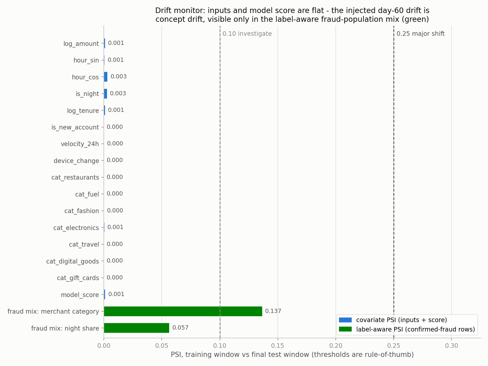

# fraud-detection-ops

I built this project around the part of fraud detection that most demos skip: the model's
score is not the product. The product is a set of operational decisions - which alerts fire,
and which of the fired alerts a small analyst team actually reviews. So this repo goes model
-> calibrated probabilities -> cost-based alert threshold -> analyst review-queue
optimization, and measures every step against honest baselines.

Two things to know before anything else:

1. **The data is synthetic.** Every transaction comes from a seeded generator I wrote
   (`fdo/data.py`): ~60,000 time-ordered transactions at ~1.45% fraud prevalence, with
   constructed patterns (night-time activity, device changes, velocity spikes, gift-card and
   digital-goods concentration, new accounts, high amounts), label noise (4% of fraud
   unreported, 0.08% false disputes) and mild pattern drift in the later window. Because
   the patterns are constructed, a model can learn them by design - the generator even
   exposes its own probabilities, which gives me an *oracle ceiling* to report against.
2. **Everything statistical is from scratch in NumPy.** No scikit-learn, no XGBoost.
   Logistic regression (stable BCE, analytic gradients, full-batch gradient descent with
   early stopping), class-weighted BCE and focal loss, Platt calibration, PR-AUC / ROC-AUC /
   Brier / ECE - all hand-written and unit-tested, including a finite-difference check on
   the gradients. SciPy is used only for its HiGHS LP/MILP solver in the queue step.

## Measured results

All numbers below are from `python -m fdo` (seed 7), measured on a strict time-based split:
train on the first 70% of the timeline (42,000 rows), validate on the next 15% (9,000),
report on the final 15% (9,000). The test window is touched only for final reporting.

### Ranking: PR-AUC against both baselines

| Scorer (test window, 1.40% prevalence)      | PR-AUC | ROC-AUC |
| ------------------------------------------- | -----: | ------: |
| Prevalence-random baseline (measured)       |  0.013 |   0.452 |
| Single rule: amount > train-p99 (measured)  |  0.034 |   0.556 |
| Logistic regression, focal loss (primary)   |  0.270 |   0.878 |
| Oracle = generator's own probabilities      |  0.367 |       - |

Precision-at-100 is 0.40: of the 100 highest-scored test transactions, 40 are fraud, against
a 1.4% base rate. The gap to the oracle (0.270 vs 0.367) is real headroom lost to label
noise, drift, and an amount-x-category interaction I deliberately withheld from the model's
features.

Why PR-AUC and not accuracy: at 1.4% prevalence, predicting "legitimate" for every
transaction is 98.6% accurate and catches nothing. Accuracy is meaningless here. PR-AUC
tracks the question the ops team actually asks - "of what we flag, how much is fraud, at
every review depth" - and its random floor equals the prevalence (0.014), which makes the
baseline comparison honest by construction.

A selection footnote: I train both losses and pick by validation PR-AUC. Focal
(gamma=2) won on validation by 0.0005; on test, weighted BCE was ahead by 0.001. The two are
statistically indistinguishable on this data - focal loss is in the repo because comparing
it fairly was the point, not because it is magic.

### Calibration: Brier and ECE, before and after Platt

|                | ECE (val) | ECE (test) | Brier (val) | Brier (test) |
| -------------- | --------: | ---------: | ----------: | -----------: |
| Raw model      |     0.367 |      0.366 |      0.159  |       0.158  |
| After Platt    |     0.003 |      0.003 |      0.012  |       0.012  |

Class-weighted training inflates probabilities on purpose (the raw model's mean predicted
fraud probability on validation is 0.38 against a true rate of 0.016). That is fine for
ranking and fatal for decisions: both the cost threshold and the queue optimizer consume
probabilities, so I fit Platt scaling on validation logits and report calibration before and
after. The Platt slope is positive, so calibration provably does not change PR-AUC - the
tests assert both.

### Cost-based threshold vs the naive 0.5 default

Cost model (both values are labelled **assumptions**, not measurements: $8 of analyst time
per review; a missed fraud costs its transaction amount):

| Policy on the test window        | Flags | Fraud caught | Total cost |
| -------------------------------- | ----: | -----------: | ---------: |
| Review nothing                   |     0 |        0/126 |    $20,744 |
| Naive threshold 0.5              |    31 |       16/126 |    $15,587 |
| Chosen threshold t* = 0.047      |   608 |       76/126 |     $8,841 |
| Review everything                | 9,000 |      126/126 |    $72,000 |

The threshold is chosen by sweeping the empirical cost curve on **validation** and then
judged on **test**: 43.3% cheaper than the 0.5 default under the stated assumptions. The 0.5
default is barely better than doing nothing - at 1.4% prevalence a calibrated model rarely
exceeds 0.5, which is exactly why default thresholds silently fail on imbalanced problems.

### Review queue: who gets reviewed when you can only review 100

The threshold fires 608 alerts on the test window, but the assumed team (4 analysts x 25
reviews) can work 100. Choosing *which* 100 is an optimization problem: maximize expected
recovered value (p_i x amount_i, calibrated p) under the capacity limit and a coverage floor
of at least 5 reviews per merchant segment, solved with SciPy's HiGHS.

| Strategy (100 reviews)                    | Expected recovered | Realized (audit) |
| ----------------------------------------- | -----------------: | ---------------: |
| Constrained optimizer (LP/MILP)           |            $11,259 |          $12,398 |
| Top-K by probability                      |             $9,793 |          $10,539 |
| Top-K by expected value (=unconstr. LP)   |            $11,328 |          $12,241 |
| Random selection (analytic expectation)   |               $231 |             $230 |

Honesty note, because this matters: **without** the coverage constraint, the LP's optimum is
exactly "sort by p x amount and take the top 100" - a fractional knapsack with unit weights.
The code verifies that equivalence numerically on every run rather than pretending a solver
adds value it doesn't. The solver earns its keep with the coverage floors on: it gives up
only 0.6% of expected value to keep all 8 segments watched (plain top-K-by-probability
leaves segments completely unreviewed and recovers 13% less, because ranking by p alone
ignores amounts). Realized value landing near expected value is the calibration paying off.

### Drift monitoring: PSI, and an honest blind spot

`python -m fdo --drift` compares the training window (days 0-84) against the final test
window (days 102-120) with the Population Stability Index, implemented from scratch in
`fdo/drift.py`. PSI bins the training distribution into deciles and measures where the
recent data moved: `PSI = sum (a_b - e_b) * ln(a_b / e_b)`. The conventional bands - below
0.10 stable, 0.10-0.25 moderate, above 0.25 major - are an industry rule of thumb from
credit-scorecard practice, not a statistical law, so the module also computes the
finite-sample noise floor (PSI is asymptotically `(1/n_e + 1/n_a) * chi2(B-1)` under "no
change", Yurdakul 2018).

Measured (seed 7, train n=42,000 vs test n=9,000):

| Monitor                                  |   PSI | Verdict |
| ---------------------------------------- | ----: | ------- |
| All 15 input features (worst: hour_cos)  | 0.003 | stable  |
| Model score distribution                 | 0.002 | stable  |
| Fraud-only merchant-category mix         | 0.137 | **moderate** (noise 95th pct: 0.135) |
| Fraud-only night-time share (52% -> 40%) | 0.057 | stable band, but above its noise 95th pct (0.037) |

The honest finding is the interesting one: **every input feature and the model score are
flat, and that is correct**. The generator's day-60 drift changes *which patterns produce
fraud* (gift-card and electronics risk up, night-time risk down) - it never changes the
feature draws themselves. That is pure concept drift, and input/score PSI is blind to it by
construction; covariate PSI crossing 0.10 here would have meant a bug, not a detection. The
drift is real and detectable, but only through a label-aware channel: among
confirmed-fraud rows, the gift-card share rises 29.5% -> 42.1% (+12.6 pp) and the
night-time share falls 52.3% -> 40.5%, putting the fraud-mix PSI at 0.137 - past the 0.10
investigate line and (marginally) past its small-sample 95th-percentile noise floor. With
only 126 test-window frauds, that margin is thin, which is exactly why the noise floor is
printed next to the statistic instead of pretending 0.10 means the same thing at every
sample size.



What a real deployment would do with this monitor:

- **Cadence.** Score PSI daily on a rolling window (it is label-free and cheap); feature
  PSI weekly per feature; the label-aware fraud-mix monitor on whatever delay confirmed
  labels arrive with (chargebacks land 30-90 days later - drift monitoring does not wait
  for them, but concept-drift *confirmation* does).
- **On alert (0.10-0.25).** Investigate before retraining: which bins moved, was it an
  upstream data/schema change, a merchant-mix change, or genuine behavior shift. Recheck
  calibration and the cost threshold t* first - both consume probabilities and go stale
  faster than ranking does.
- **On major shift (>0.25) or a confirmed concept drift.** Retrain on a window that
  includes the shifted regime, re-fit calibration, re-sweep the threshold, and re-validate
  the queue's coverage floors; then review the thresholds themselves - 0.10/0.25 defaults
  deserve periodic re-derivation from the monitored population's actual noise floor.
- **Blind-spot coverage.** Because input PSI misses concept drift, a deployment should
  also track realized precision/recall of reviewed alerts (the analyst queue doubles as a
  continuous labelled sample) - a drop there with flat input PSI is the concept-drift
  signature this repo demonstrates.

## How to run

```
pip install -r requirements.txt
python -m pytest -q          # 24 tests, ~20 s
python -m ruff check .
python -m fdo                # run everything, print the measured summary
python -m fdo --drift        # PSI drift monitor (train vs test window) + figures/drift_psi.png
python -m fdo --deliverables # also write deliverables/ (executive PDF + Excel workbook)
```

Python 3.12+ (CI runs 3.12; developed on 3.14). Console output is ASCII-only and UTF-8-safe
on Windows.

## Layout

```
fdo/data.py       seeded synthetic generator (patterns, noise, drift documented)
fdo/model.py      from-scratch logistic regression, focal loss, time split, Platt scaling
fdo/evaluate.py   from-scratch PR-AUC, ROC-AUC, P@k, Brier, ECE, reliability + baselines
fdo/threshold.py  cost-assumption-labelled threshold sweep vs the naive 0.5
fdo/queue_opt.py  capacity+coverage-constrained review allocation (HiGHS LP/MILP)
fdo/drift.py      from-scratch PSI drift monitor + label-aware fraud-mix monitor
fdo/pipeline.py   one deterministic run shared by CLI, exports, and tests
fdo/exports.py    executive PDF (matplotlib PdfPages) + Excel workbook (openpyxl)
tests/            24 tests: math checks, leakage guards, economics, exports, drift
docs/BUSINESS_CASE.md  the same story in business terms, assumptions labelled
```

## Limitations

- The fraud patterns are constructed, so learnability is guaranteed in a way it never is in
  production; the oracle ceiling makes that explicit rather than hiding it.
- All dollar figures downstream of the model rest on assumed costs ($8/review, missed fraud
  = amount). Change the assumptions and the optimal threshold moves; the code makes them
  explicit knobs.
- No adversarial adaptation: real fraudsters probe rules and shift behavior. Nothing here
  models that feedback loop - the drift in the generator is scheduled, not responsive.
- One linear model family. The point is the operational machinery around a model, not
  model-architecture competition.
- Velocity features are drawn per transaction rather than derived from simulated
  per-customer histories.

## License

© 2026 Dimitres Kisimov — all rights reserved; published for portfolio review.
See [LICENSE](LICENSE). Credits and references in [CREDITS.md](CREDITS.md).
