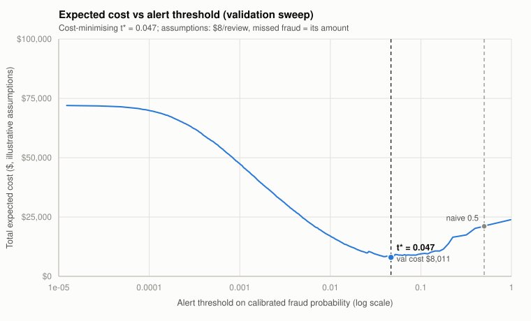
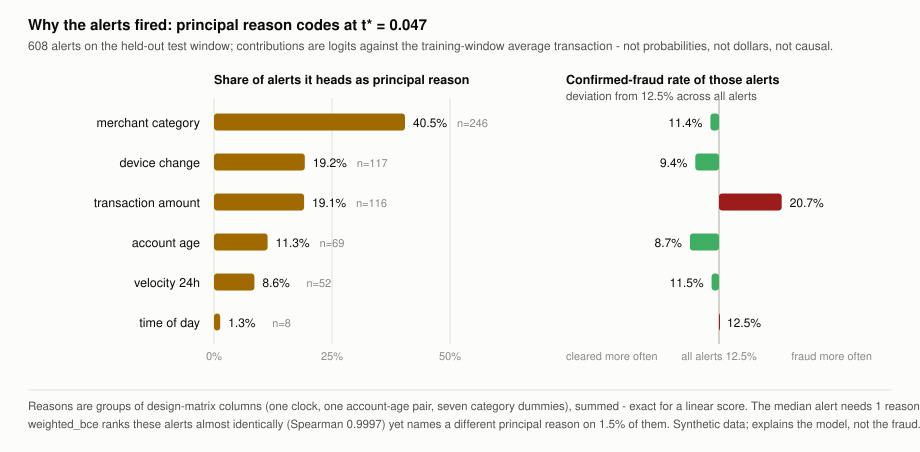

# fraud-detection-ops

I built this project around the part of fraud detection that most demos skip: the model's
score is not the product. The product is a set of operational decisions - which alerts fire,
and which of the fired alerts a small analyst team actually reviews. So this repo goes model
-> calibrated probabilities -> cost-based alert threshold -> analyst review-queue
optimization, and measures every step against honest baselines.

Two things to know before anything else:

1. **The data is synthetic.** Every transaction comes from a seeded generator I wrote
   (`fdo/data.py`): ~60,000 time-ordered transactions at ~1.45% fraud prevalence, with
   constructed patterns (night-time activity, device changes, velocity spikes, gift-card and
   digital-goods concentration, new accounts, high amounts), label noise (4% of fraud
   unreported, 0.08% false disputes) and mild pattern drift in the later window. Because
   the patterns are constructed, a model can learn them by design - the generator even
   exposes its own probabilities, which gives me an *oracle ceiling* to report against.
2. **Everything statistical is from scratch in NumPy.** No scikit-learn, no XGBoost.
   Logistic regression (stable BCE, analytic gradients, full-batch gradient descent with
   early stopping), class-weighted BCE and focal loss, Platt calibration, PR-AUC / ROC-AUC /
   Brier / ECE - all hand-written and unit-tested, including a finite-difference check on
   the gradients. SciPy is used only for its HiGHS LP/MILP solver in the queue step.

## Measured results

All numbers below are from `python -m fdo` (seed 7), measured on a strict time-based split:
train on the first 70% of the timeline (42,000 rows), validate on the next 15% (9,000),
report on the final 15% (9,000). The test window is touched only for final reporting.

### Ranking: PR-AUC against both baselines

| Scorer (test window, 1.40% prevalence)      | PR-AUC | ROC-AUC |
| ------------------------------------------- | -----: | ------: |
| Prevalence-random baseline (measured)       |  0.013 |   0.452 |
| Single rule: amount > train-p99 (measured)  |  0.034 |   0.556 |
| Logistic regression, focal loss (primary)   |  0.270 |   0.878 |
| Oracle = generator's own probabilities      |  0.367 |       - |

Precision-at-100 is 0.40: of the 100 highest-scored test transactions, 40 are fraud, against
a 1.4% base rate. The gap to the oracle (0.270 vs 0.367) is real headroom lost to label
noise, drift, and an amount-x-category interaction I deliberately withheld from the model's
features.

Why PR-AUC and not accuracy: at 1.4% prevalence, predicting "legitimate" for every
transaction is 98.6% accurate and catches nothing. Accuracy is meaningless here. PR-AUC
tracks the question the ops team actually asks - "of what we flag, how much is fraud, at
every review depth" - and its random floor equals the prevalence (0.014), which makes the
baseline comparison honest by construction.

A selection footnote: I train both losses and pick by validation PR-AUC. Focal
(gamma=2) won on validation by 0.0005; on test, weighted BCE was ahead by 0.001. The two are
statistically indistinguishable on this data - focal loss is in the repo because comparing
it fairly was the point, not because it is magic.

### Calibration: Brier and ECE, before and after Platt

|                | ECE (val) | ECE (test) | Brier (val) | Brier (test) |
| -------------- | --------: | ---------: | ----------: | -----------: |
| Raw model      |     0.367 |      0.366 |      0.159  |       0.158  |
| After Platt    |     0.003 |      0.003 |      0.012  |       0.012  |

Class-weighted training inflates probabilities on purpose (the raw model's mean predicted
fraud probability on validation is 0.38 against a true rate of 0.016). That is fine for
ranking and fatal for decisions: both the cost threshold and the queue optimizer consume
probabilities, so I fit Platt scaling on validation logits and report calibration before and
after. The Platt slope is positive, so calibration provably does not change PR-AUC - the
tests assert both.

### Cost-based threshold vs the naive 0.5 default

Cost model (both values are labelled **assumptions**, not measurements: $8 of analyst time
per review; a missed fraud costs its transaction amount):

| Policy on the test window        | Flags | Fraud caught | Total cost |
| -------------------------------- | ----: | -----------: | ---------: |
| Review nothing                   |     0 |        0/126 |    $20,744 |
| Naive threshold 0.5              |    31 |       16/126 |    $15,587 |
| Chosen threshold t* = 0.047      |   608 |       76/126 |     $8,841 |
| Review everything                | 9,000 |      126/126 |    $72,000 |

The threshold is chosen by sweeping the empirical cost curve on **validation** and then
judged on **test**: 43.3% cheaper than the 0.5 default under the stated assumptions. The 0.5
default is barely better than doing nothing - at 1.4% prevalence a calibrated model rarely
exceeds 0.5, which is exactly why default thresholds silently fail on imbalanced problems.

`python -m fdo --decision` renders that validation sweep as a standalone, hand-drawn SVG
(`figures/cost_curve.svg`, no plotting dependency - pure string construction, so the
committed figure is byte-deterministic) and writes the per-threshold table it plots to
`figures/cost_curve.csv` (threshold, review-queue volume, precision, recall, cost
breakdown). The same command prints a plain-language recommendation naming t\*, the alerts
it sends to the queue, and the assumptions it rests on. `fdo/cost_curve.py` reads the sweep
`fdo/threshold.py` already computes - it adds the artifacts, not a second cost calculation.



### Review queue: who gets reviewed when you can only review 100

The threshold fires 608 alerts on the test window, but the assumed team (4 analysts x 25
reviews) can work 100. Choosing *which* 100 is an optimization problem: maximize expected
recovered value (p_i x amount_i, calibrated p) under the capacity limit and a coverage floor
of at least 5 reviews per merchant segment, solved with SciPy's HiGHS.

| Strategy (100 reviews)                    | Expected recovered | Realized (audit) |
| ----------------------------------------- | -----------------: | ---------------: |
| Constrained optimizer (LP/MILP)           |            $11,259 |          $12,398 |
| Top-K by probability                      |             $9,793 |          $10,539 |
| Top-K by expected value (=unconstr. LP)   |            $11,328 |          $12,241 |
| Random selection (analytic expectation)   |               $231 |             $230 |

Honesty note, because this matters: **without** the coverage constraint, the LP's optimum is
exactly "sort by p x amount and take the top 100" - a fractional knapsack with unit weights.
The code verifies that equivalence numerically on every run rather than pretending a solver
adds value it doesn't. The solver earns its keep with the coverage floors on: it gives up
only 0.6% of expected value to keep all 8 segments watched (plain top-K-by-probability
leaves segments completely unreviewed and recovers 13% less, because ranking by p alone
ignores amounts). Realized value landing near expected value is the calibration paying off.

### Queue fairness: fraud-catch coverage by segment

Money is not the only axis an ops lead answers for. `fdo/fairness.py` reads out, per
merchant segment on the test window, the share of that segment's fraud each decision
actually catches - the question an auditor asks that a single recall number hides. The
cost-sensitive threshold t\*=0.047 catches 60% of test-window fraud overall, but that
average is deeply uneven:

| Segment (test window) | Fraud | Caught at t\*=0.047 | Catch rate |
| --------------------- | ----: | ------------------: | ---------: |
| gift_cards            |    53 |                  43 |        81% |
| digital_goods         |    25 |                  18 |        72% |
| electronics           |    17 |                   9 |        53% |
| travel                |     5 |                   2 |        40% |
| fashion               |     6 |                   2 |        33% |
| fuel                  |     8 |                   1 |        13% |
| restaurants           |     8 |                   1 |        13% |
| grocery               |     4 |                   0 |         0% |

That is an 81-percentage-point coverage gap, and it is not a bug: a cost-weighted policy
concentrates on high-value segments **by design** (a missed gift-card fraud is assumed to
cost its large amount; a missed grocery fraud, its small one), so **equal dollars is not
equal protection**. The capacity-limited review queue is more concentrated still - it
catches 26% of fraud overall and reviews *nothing* in three low-value segments. The queue's
coverage floor is worth being precise about: it guards review **headcount** per segment
(at least 5 reviews each), which is not the same as guaranteeing a fraud-catch **rate**.
Surfacing the gap is the point; whether to close it (a per-segment recall floor, a
fairness-constrained threshold) is a policy decision, and a labelled one, not a default.
The full read-out for both decisions is written to `figures/queue_fairness.csv` by
`python -m fdo --decision` and drawn as a page in the executive PDF.

### Drift monitoring: PSI, and an honest blind spot

`python -m fdo --drift` compares the training window (days 0-84) against the final test
window (days 102-120) with the Population Stability Index, implemented from scratch in
`fdo/drift.py`. PSI bins the training distribution into deciles and measures where the
recent data moved: `PSI = sum (a_b - e_b) * ln(a_b / e_b)`. The conventional bands - below
0.10 stable, 0.10-0.25 moderate, above 0.25 major - are an industry rule of thumb from
credit-scorecard practice, not a statistical law, so the module also computes the
finite-sample noise floor (PSI is asymptotically `(1/n_e + 1/n_a) * chi2(B-1)` under "no
change", Yurdakul 2018).

Measured (seed 7, train n=42,000 vs test n=9,000):

| Monitor                                  |   PSI | Verdict |
| ---------------------------------------- | ----: | ------- |
| All 15 input features (worst: hour_cos)  | 0.003 | stable  |
| Model score distribution                 | 0.002 | stable  |
| Fraud-only merchant-category mix         | 0.137 | **moderate** (noise 95th pct: 0.135) |
| Fraud-only night-time share (52% -> 40%) | 0.057 | stable band, but above its noise 95th pct (0.037) |

The honest finding is the interesting one: **every input feature and the model score are
flat, and that is correct**. The generator's day-60 drift changes *which patterns produce
fraud* (gift-card and electronics risk up, night-time risk down) - it never changes the
feature draws themselves. That is pure concept drift, and input/score PSI is blind to it by
construction; covariate PSI crossing 0.10 here would have meant a bug, not a detection. The
drift is real and detectable, but only through a label-aware channel: among
confirmed-fraud rows, the gift-card share rises 29.5% -> 42.1% (+12.6 pp) and the
night-time share falls 52.3% -> 40.5%, putting the fraud-mix PSI at 0.137 - past the 0.10
investigate line and (marginally) past its small-sample 95th-percentile noise floor. With
only 126 test-window frauds, that margin is thin, which is exactly why the noise floor is
printed next to the statistic instead of pretending 0.10 means the same thing at every
sample size.


What a real deployment would do with this monitor:

- **Cadence.** Score PSI daily on a rolling window (it is label-free and cheap); feature
  PSI weekly per feature; the label-aware fraud-mix monitor on whatever delay confirmed
  labels arrive with (chargebacks land 30-90 days later - drift monitoring does not wait
  for them, but concept-drift *confirmation* does).
- **On alert (0.10-0.25).** Investigate before retraining: which bins moved, was it an
  upstream data/schema change, a merchant-mix change, or genuine behavior shift. Recheck
  calibration and the cost threshold t* first - both consume probabilities and go stale
  faster than ranking does.
- **On major shift (>0.25) or a confirmed concept drift.** Retrain on a window that
  includes the shifted regime, re-fit calibration, re-sweep the threshold, and re-validate
  the queue's coverage floors; then review the thresholds themselves - 0.10/0.25 defaults
  deserve periodic re-derivation from the monitored population's actual noise floor.
- **Blind-spot coverage.** Because input PSI misses concept drift, a deployment should
  also track realized precision/recall of reviewed alerts (the analyst queue doubles as a
  continuous labelled sample) - a drop there with flat input PSI is the concept-drift
  signature this repo demonstrates. How far that "labelled sample" can actually be
  trusted is measured in the feedback-loop section below.

### Champion/challenger: executing the retrain playbook, with a promotion gate

The playbook above ends with "retrain on a window that includes the shifted regime, re-fit
calibration, re-sweep the threshold". `python -m fdo --challenger` (`fdo/challenger.py`)
executes exactly that, then asks the governance question that actually gates a model swap
in production: does the retrained **challenger** beat the incumbent **champion** by enough,
on criteria declared before looking, to be promoted?

One variable changes. The challenger is the same model family, loss, and hyperparameters as
the champion - deliberately no architecture competition (see limitations) - retrained on a
rolling window that drops the oldest 15% of the timeline (days 18-93 instead of 0-84, so it
sees more of the post-day-60 drifted regime) and re-calibrated + re-swept on the freshest
pre-test slice (days 93-102). Both models are judged once, on the identical held-out test
window (days 102-120); the harness verifies the test indices match row for row.

| Test window, each model at its own t* | Champion | Challenger |
| ------------------------------------- | -------: | ---------: |
| PR-AUC / ROC-AUC                      | 0.270 / 0.878 | 0.264 / 0.878 |
| ECE after Platt                       | 0.0029 | 0.0022 |
| Cost threshold t* (swept on own val)  | 0.047 | 0.053 |
| Alerts fired                          | 608 | 471 |
| Fraud caught                          | 76/126 | 72/126 |
| Total cost (same assumptions)         | $8,841 | $8,632 |

The swap-set - the first read-out a credit-risk reviewer asks for - explains where the win
comes from:

| Swap cell                 |     n | Fraud | Fraud rate | Fraud value |
| ------------------------- | ----: | ----: | ---------: | ----------: |
| Flagged by both           |   469 |    72 |      15.4% |     $15,881 |
| Champion only (swap-out)  |   139 |     4 |       2.9% |        $886 |
| Challenger only (swap-in) |     2 |     0 |       0.0% |          $0 |
| Neither                   | 8,390 |    50 |       0.6% |      $3,977 |

The retrain does not find new fraud: it swaps in just 2 alerts and catches 4 *fewer*
frauds. It wins by shedding load - 139 champion alerts at a 2.9% fraud rate leave the
queue, trading $886 of newly missed fraud for $1,096 of analyst time (137 fewer reviews x
$8), a net $210 (2.4%) cheaper. That arithmetic *is* the swap-out cell, which is why the
read-out exists. At a fixed 100-review capacity the challenger *expects* less recovered
value ($9,487 vs $11,328, its drift-era probabilities are more conservative) and realizes
about the same ($12,362 vs $12,241) - the better-calibrated model promises less and keeps
its promise.

Five pre-declared gates (policy knobs, not statistical laws: test PR-AUC within 0.010 of
the champion, post-Platt ECE <= 0.020, cost at its own t* non-worse, alert volume <= 1.5x
the champion's, no new zero-coverage segment) all pass on this run, so the measured verdict
is **PROMOTE**. Read it honestly: the $210 margin is modelled, not measured, and rests
entirely on the $8/review assumption - price analyst time at $0 and the champion wins on
missed-fraud dollars alone; the ranking is slightly *worse* (0.264 vs 0.270, inside the
declared epsilon). The gate exists precisely so a retrain has to earn promotion rather
than being reflexive - a HOLD would have been an equally publishable result. The full
comparison lands in `figures/champion_challenger.csv` and the swap-set in
`figures/challenger_swap.csv`, both byte-deterministic.

### Feedback loop: when reviewed alerts become tomorrow's training labels

The drift playbook above leans on a comforting idea: "the analyst queue doubles as a
continuous labelled sample". `python -m fdo --feedback` (`fdo/feedback.py`) stress-tests
that idea, because in production it is only half true: analysts confirm labels **only on
the alerts they review**, and every unreviewed transaction ages into the next training set
with whatever label the pipeline assumes. That closed loop is the **selective-labels
problem** (Lakkaraju et al. 2017; "delayed feedback" in the fraud/ads literature), and it
is invisible on a production dashboard precisely because the missing labels are missing.
Only a simulation with ground truth can price it - which is what synthetic data is for.

The setup: an initial model trains on the first 40% of the timeline as fully labelled
history (days 0-48, 24,000 rows - "chargebacks there have matured" is itself a labelled
assumption). Its cost threshold t0\* = 0.035 and a 100-reviews-per-round capacity are then
**frozen**, so the labelling policy is the only variable between arms. The remaining
pre-test timeline (days 48-102, spanning the generator's day-60 concept drift) is deployed
in three rounds of 9,000 rows: each round, four arms score the traffic with their own
current model, review the top-100 alerts by p x amount (the repo's queue rule), append the
round to their training pool under four labelling policies, retrain (same family, loss,
and hyperparameters), and are evaluated on the same held-out test window as everything
else in this repo (reporting only - nothing feeds back). Measured, after round 3:

| Arm (what unreviewed rows become)     | Pool   | Labelled prev. | Fraud labelled legit | PR-AUC |    ECE | Recall at t0\* | Alerts |
| ------------------------------------- | -----: | -------------: | -------------------: | -----: | -----: | -------------: | -----: |
| full_labels (oracle, simulation-only) | 51,000 |          1.46% |                    0 |  0.268 | 0.0031 |            63% |    806 |
| chargeback (85% self-report)          | 51,000 |          1.36% |                   52 |  0.273 | 0.0026 |            63% |    731 |
| assume_legit (labelled legitimate)    | 51,000 |          0.89% |                  292 |  0.272 | 0.0100 |            44% |    197 |
| reviewed_only (left out of the pool)  | 24,300 |          1.82% |                    0 |  0.271 | 0.0031 |            63% |    746 |

The measured mechanism is not the one folklore expects. **Ranking survives - final PR-AUC
spans just 0.268-0.273 across arms** - because the clean 24,000-row initial history
anchors it. What label censoring poisons is the **probabilities**: retraining with 292
frauds relabelled as legitimate drags the assume_legit arm's labelled prevalence to 0.89%
against a true 1.46%, its test ECE to 0.0100 (3.2x the oracle arm's 0.0031), and therefore
its alert volume at the frozen threshold from 651 down to 197 - an alert-starvation spiral
(fewer alerts -> fewer reviews -> fewer fraud labels -> still-lower probabilities; by
round 2 its live model fired 102 alerts on 9,000 transactions). Test recall at t0\*
collapses 61% -> 37% -> 42% -> 44% across rounds while the oracle arm holds 62-67%, and a
second zero-coverage merchant segment appears. Every decision layer in this repo -
threshold, queue EV - consumes calibrated probabilities, so censoring poisons exactly the
part the decisions trust.

Meanwhile the poisoned arm's own dashboard says nothing is wrong: its *observed* recall
(fraud caught / fraud it knows about) reads **100% every round, by construction** - the
only fraud it knows about is the fraud it reviewed - while its true label coverage is
23-35%. The model grades its own homework. Two honest footnotes. First, the chargeback arm
shows why production survives this at all: with 85% of missed fraud self-reporting it
recovers oracle-level recall carrying only 52 poisoned labels - but chargebacks land at
the round boundary here, and real 30-90 day delays would blunt that recovery. Second,
under the stated $8/review assumptions the starved arm's measured test cost is actually
*lower* ($8,220 vs $9,911), because the frozen t0\* over-alerts for the healthy models -
a warning about judging policies by a cost metric with a stale threshold, not a defense of
label poisoning. The reviewed_only arm barely moves (its pool grows 24,000 -> 24,300,
fraud-enriched to 1.82% labelled prevalence by its own opinions) and loses almost nothing
on this generator's mild drift - a generator property, not a general truth. The full
per-round trajectory lands in `figures/feedback_loop.csv`, byte-deterministic.

### Reason codes: why THIS alert fired, and what the queue changes about it

Every section above answers a population question. An analyst opening one alert asks a
different one - and so does QA, and so does anyone who has to defend the queue in a
model-risk review: *why is this transaction in front of me?* `python -m fdo --reasons`
(`fdo/reasons.py`) answers it in the shape regulated lending answers it, a short list of
**principal reasons**, computed from the model this repo already trained: no surrogate
model, no sampling, no randomness.

The decomposition is exact rather than approximate, which is the only reason it is worth
shipping. The champion is linear in its standardized features, so fixing a **reference
profile** `r` - the mean training-window transaction, which scores `z(r)` = -0.509 - makes

```
z(x) = z(r) + sum_j theta_j * (xtilde_j - r_j)
```

an identity, and for a model linear in its inputs those per-feature terms *are* the Shapley
values of the score under an interventional reference. The tests assert that against
brute-force enumeration over all 2^m coalitions, so the claim is checked in CI rather than
cited. Redundant encodings are summed into six **reason groups** first (one clock spread
across `hour_sin`, `hour_cos`, `is_night`; account age across `log_tenure`,
`is_new_account`; seven merchant-category dummies) - grouping is exactly additive for a
linear score, and it is what stops an explanation from saying "hour_cos". The alert cut is
carried into logit space exactly (`z >= (logit(t*) - b) / a`), so the explained set is the
same 608 alerts the shipped threshold fires, never a re-derived one.

Measured over those 608 alerts at t\* = 0.047 on the held-out test window (12.5% of them
confirmed fraud):

| Reason group         | Principal reason for | Listed at all | Mean contribution (logits) | Confirmed fraud when principal | Mean amount |
| -------------------- | -------------------: | ------------: | -------------------------: | -----------------------------: | ----------: |
| `merchant_category`  |           40.5% (246) |         80.3% |                     +0.377 |                          11.4% |         $92 |
| `device_change`      |           19.2% (117) |         24.8% |                     +0.144 |                           9.4% |         $83 |
| `transaction_amount` |           19.1% (116) |         83.6% |                     +0.302 |                          20.7% |        $358 |
| `account_age`        |            11.3% (69) |         24.5% |                     +0.100 |                           8.7% |         $93 |
| `velocity_24h`       |             8.6% (52) |         57.4% |                     +0.125 |                          11.5% |         $74 |
| `time_of_day`        |              1.3% (8) |         59.5% |                     +0.175 |                          12.5% |         $84 |

Three things fall out of that table that no aggregate metric in this repo shows:

- **The most common reason is not the most predictive one.** `merchant_category` heads 40.5%
  of alerts, and those alerts are confirmed fraud 11.4% of the time - *below* the 12.5%
  all-alert average - while `transaction_amount` heads 19.1% at 20.7%. Reason frequency and
  reason precision are different quantities, and only the per-alert view separates them.
  `time_of_day` is the mirror image: listed on 59.5% of alerts, principal on 1.3% - a
  background contributor that is almost never the driver.
- **The queue rewrites the mix an analyst actually sees.** The 100 reviews the optimizer
  selects are headed by `transaction_amount` on 59.0% of rows against 19.1% across all
  alerts, because the queue ranks by `p x amount` and amount also enters the score. That
  worklist is 33.0% confirmed fraud against 12.5% across alerts - the dollar weighting is
  doing exactly what it was asked to do, and it means the reason distribution an analyst
  experiences is not the reason distribution of the alert population.
- **Most alerts rest on a single reason.** Removing just the largest contribution drops
  88.7% of alerts back under the threshold (median 1, against 3.30 reasons listed per
  alert). These alerts sit close to the cut, so a notice with four lines on it is thinner
  than it looks.

The layer also reports its own fragility. The two models the pipeline trains rank these
transactions almost identically - Spearman 0.9997 on calibrated probabilities - yet name a
different principal reason on 1.5% of alerts. Ranking agreement is not explanation
agreement, and a shop that swaps models on a PR-AUC tie will quietly change the reasons it
gives people.



`figures/reason_code_summary.csv` carries the table above and `figures/reason_codes.csv` the
per-alert notice for all 100 queued reviews (up to four ranked reasons with their
contributions, the score, and how many reasons it takes to cross the threshold) - both
byte-deterministic.

Read honestly: contributions are **logits against a stated reference**, not probabilities,
not dollars, not causal - change the reference and every number changes. "Reasons to cross"
is arithmetic inside the model, not a claim the transaction would have been legitimate. The
model has known headroom against the oracle (the generator withholds an amount x
gift/digital interaction from the design matrix on purpose), so a faithful account of the
*score* can still be an incomplete account of the *fraud*. And the four-reason format is
borrowed from ECOA / Regulation B adverse-action practice as a discipline: a fraud alert is
not a credit denial, and nothing here is legal advice.

## How to run

```
pip install -r requirements.txt
python -m pytest -q          # 78 tests, ~85 s
python -m ruff check .
python -m fdo                # run everything, print the measured summary
python -m fdo --drift        # PSI drift monitor (train vs test window) + figures/drift_psi.png
python -m fdo --decision     # cost-curve recommendation + queue-fairness read-out;
                             #   writes figures/cost_curve.svg + cost_curve.csv + queue_fairness.csv
python -m fdo --challenger   # champion/challenger retrain harness: swap-set + PROMOTE/HOLD gate;
                             #   writes figures/champion_challenger.csv + challenger_swap.csv
python -m fdo --feedback     # analyst feedback-loop simulation (selective-labels problem,
                             #   4 labelling-policy arms); writes figures/feedback_loop.csv
python -m fdo --reasons      # reason codes: principal reasons per alert (exact Shapley
                             #   decomposition); writes figures/reason_code_summary.csv +
                             #   reason_codes.csv + reason_codes.svg
python -m fdo --deliverables # also write deliverables/ (executive PDF + Excel workbook)
```

Python 3.12+ (CI runs 3.12; developed on 3.14). Console output is ASCII-only and UTF-8-safe
on Windows.

## Layout

```
fdo/data.py       seeded synthetic generator (patterns, noise, drift documented)
fdo/model.py      from-scratch logistic regression, focal loss, time split, Platt scaling
fdo/evaluate.py   from-scratch PR-AUC, ROC-AUC, P@k, Brier, ECE, reliability + baselines
fdo/threshold.py  cost-assumption-labelled threshold sweep vs the naive 0.5
fdo/cost_curve.py cost-vs-threshold artifacts (hand-drawn SVG + CSV) + plain-language rec.
fdo/queue_opt.py  capacity+coverage-constrained review allocation (HiGHS LP/MILP)
fdo/fairness.py   per-segment fraud-catch coverage (queue-fairness read-out)
fdo/drift.py      from-scratch PSI drift monitor + label-aware fraud-mix monitor
fdo/challenger.py champion/challenger retrain harness: swap-set analysis + gated promotion
fdo/feedback.py   analyst feedback-loop simulation: selective-labels problem, 4 policy arms
fdo/reasons.py    reason codes: exact Shapley decomposition of the score, grouped, per alert
fdo/palette.py    the one place the figure palette lives (validator run recorded in it)
fdo/pipeline.py   one deterministic run shared by CLI, exports, and tests
fdo/exports.py    executive PDF (matplotlib PdfPages) + Excel workbook (openpyxl)
tests/            78 tests: math checks, leakage guards, economics, fairness, exports, drift,
                  champion/challenger, feedback loop, reason codes
docs/BUSINESS_CASE.md  the same story in business terms, assumptions labelled
```

## Limitations

- The fraud patterns are constructed, so learnability is guaranteed in a way it never is in
  production; the oracle ceiling makes that explicit rather than hiding it.
- All dollar figures downstream of the model rest on assumed costs ($8/review, missed fraud
  = amount). Change the assumptions and the optimal threshold moves; the code makes them
  explicit knobs.
- The queue-fairness read-out *surfaces* the per-segment coverage gap; it does not close
  it. There is no per-segment recall floor or fairness-constrained threshold here - adding
  one is a labelled policy choice, and the honest default is to show the gap, not to bury it
  under a single overall recall number.
- No adversarial adaptation: real fraudsters probe rules and shift behavior. The feedback
  loop that *is* modelled (`--feedback`) is the label loop, not an adversary - the drift in
  the generator is scheduled, not responsive.
- The feedback-loop simulation is a model of a process, not a measurement of one: review
  capacity and the 85% chargeback rate are labelled assumptions, chargebacks land at the
  round boundary instead of 30-90 days late (flattering every censored arm), the alert
  policy is frozen by design, and "ranking survives censoring" is a property of this
  generator's learnable patterns plus a large clean history - not a promise that it
  survives in production.
- One linear model family. The point is the operational machinery around a model, not
  model-architecture competition - which is why the challenger keeps the champion's family,
  loss, and hyperparameters and moves only the training window. The promotion-gate knobs
  (epsilon, ECE bound, cost margin, volume ratio) are declared policy assumptions, and the
  $210 promotion margin is modelled under the stated costs, not a measured saving.
- Velocity features are drawn per transaction rather than derived from simulated
  per-customer histories.
- The reason codes are exact *for this model family and this reference*, and that is the
  whole of the claim. Linear-model Shapley values are a closed form; a gradient-boosted or
  neural score would need sampling-based attribution with its own error bars, and a
  different reference profile (a segment mean, a nearest-neighbour set) would move every
  number. Correlated groups still share credit between themselves - grouping fixes the
  redundant *encodings* of one concept, not the genuine correlation between amount and
  merchant category. And an explanation faithful to the score is not automatically an
  explanation of the fraud: the model's oracle gap is still there underneath.
- There is no entity graph, so nothing here does fraud-ring or shared-device detection: the
  generator emits independent transactions with no customer, merchant or device identifiers
  to link them by. Adding that would be a generator change, not an analysis change.

## License

© 2026 Dimitres Kisimov — all rights reserved; published for portfolio review.
See [LICENSE](LICENSE). Credits and references in [CREDITS.md](CREDITS.md).
